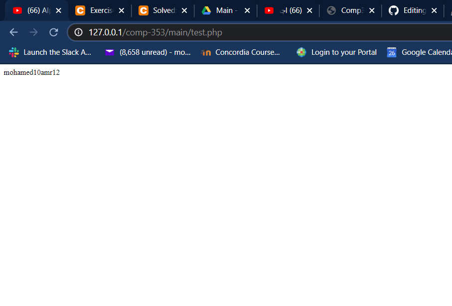

# **Contributors**

Mohamed Hefny  40033382  
Aloys Portafaix  40030443  
Caren Rizk  40031705  
Robert Beaudenon  

**To run PHP**
1. Download xampp (v3.2.2) tested
2. Start the xampp control panel
3. Start Apache and mysql from the control panel
4. Clone the comp-353 reprository to xampp/htdocs
5. enter 'http://127.0.0.1/comp-353/main/test.php' in your web browser to test a the php script, you should get a database error
6. go to http://localhost/phpmyadmin
7. create a new database called 'web_career'
8. Select the database and run the following script  
      create table test_employer(  
      name varchar(20),  
      age int  
      );  
      insert into test_employer values ('amr',123);  
      insert into test_employer values ('mo',123);  
 9. Go back to 'http://127.0.0.1/comp-353/main/test.php', some values should be shown as follows:  
 
 
      
